<p align="center">
  
</p>

<p align="center">
  <a href="https://github.com/rojnwa/cleanse-for-blitz/releases/latest"></a>
  <a href="https://github.com/rojnwa/cleanse-for-blitz/releases"></a>
  <a href="https://github.com/rojnwa/cleanse-for-blitz/actions/workflows/ci.yml"></a>
</p>

Cleanse is an ad blocker for the [Blitz](https://blitz.gg) desktop app on Windows. It removes ads,
trackers and the cookie banner for League of Legends, TFT and VALORANT. The ad column disappears too,
so pages like champion builds use the full window width. Nothing extra to install, and none of Blitz's
files are changed.

## Get started

Press the Windows key, type **PowerShell**, open it, paste this line and press Enter:

```powershell
irm https://github.com/rojnwa/cleanse-for-blitz/releases/latest/download/cleanse.ps1 | iex
```

Choose whether Blitz should start ad-free when Windows starts, and Blitz opens without ads. From now
on, open Blitz with the **Cleanse for Blitz** shortcut on your desktop or in the Start menu.

To remove Cleanse, paste this instead. Blitz itself stays installed.

```powershell
iex "& {$(irm https://github.com/rojnwa/cleanse-for-blitz/releases/latest/download/cleanse.ps1)} -Uninstall"
```

## Questions

**Is it safe to paste that?** The line downloads and runs `cleanse.ps1` from the
[latest release](https://github.com/rojnwa/cleanse-for-blitz/releases/latest), a plain-text script.
Each release is built from its tagged source by GitHub Actions and checked by PSScriptAnalyzer.

**Can I read it before running it?** Yes. Download `cleanse.ps1` from the latest release and open it
in Notepad. Releases can't be changed once published, so it's exactly the file the install line runs.

**Blitz restarted when I opened it.** If Blitz was already open the normal way, it's restarted once so
ads can be blocked.

**Blitz opens twice at login.** Turn off Blitz's own "launch on startup" setting and let Cleanse start
it instead (paste the install line again to change that choice).

**Does it work with Blitz for Fortnite, CS2 or Marvel Rivals?** No. Those are separate Blitz apps.
Cleanse works with the main Blitz app (League of Legends, TFT and VALORANT).

**Ads are back after a Blitz update.** Blitz probably changed its ad provider. Cleanse updates itself
every time you open Blitz with it, so a fix arrives on its own once it's released.

## How it works

Blitz is built on Chromium. The shortcut starts Blitz with a local debugging port and connects to it
through the Chrome DevTools Protocol to:

- cancel requests to ad networks, the cookie-banner provider and analytics (Blitz's own servers are
  left alone);
- hide the empty ad slots and give the reserved ad column back to the content.

It stops by itself when you close Blitz. On each start it checks for a newer release and updates
itself. It uses only the PowerShell built into Windows 10 and 11.
The debugging port only accepts connections from your own PC, but any program on your PC can use it
while Blitz runs.

## Legal

GPLv3. See [LICENSE](LICENSE).

Cleanse isn't affiliated with or endorsed by Blitz App, Inc. Blitz is a trademark of Blitz App, Inc.

Cleanse was created under Riot Games' "Legal Jibber Jabber" policy using assets owned by Riot Games.
Riot Games does not endorse or sponsor this project.
